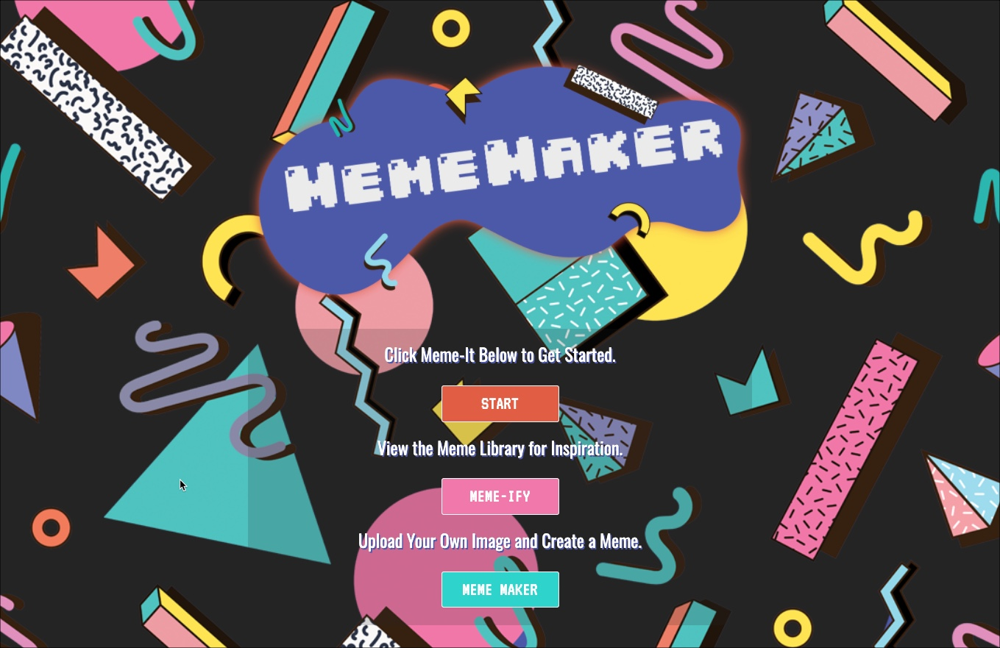

# Meme-Maker-2077

## Table of Contents

[Description](#description)  
[User Story](#user-story)  
[Technologies Used](#technologies-used)  
[Links and Screenshots](#links-and-screenshots)  
[Collaborators](#collaborators)

## Description

The Meme Maker 2077 is a web application where users can select an image from an image library or upload their own image to create a meme.
Users can add text to the image, edit the text on the image and then download the meme as a PNG file once they are finished.

## User Story

AS A user  
I WANT to choose from a library of images or upload my own image  
AND I WANT to add text to that image  
SO THAT I can create my own meme and download it for saving and sharing

## Technologies Used

- HTML
- CSS
- Bootstrap
- JavaScript
- Node.js
- Express
- Express Handlebars
- Sequelize
- MySQL
- MySQL2
- JAWSDB
- Heroku
- Cloudinary
- Canvas API
- Repl.it
- fileReader.js
- Body-Parser
- Travis CI

## Links and Screenshots

GitHub Repository: https://github.com/MeganCarnaghi/Meme-Maker-2077.git

Deployed Application: https://meme-maker-2077.herokuapp.com/

## Collaborators

- [bjsmak](https://github.com/bjsmak)
- [MeganCarnaghi](https://github.com/MeganCarnaghi)
- [IsaacF](https://github.com/blackedoutkeys)
- [emkaygru](https://github.com/emkaygru)
- [D. Thomas](https://github.com/dunkkid23)
